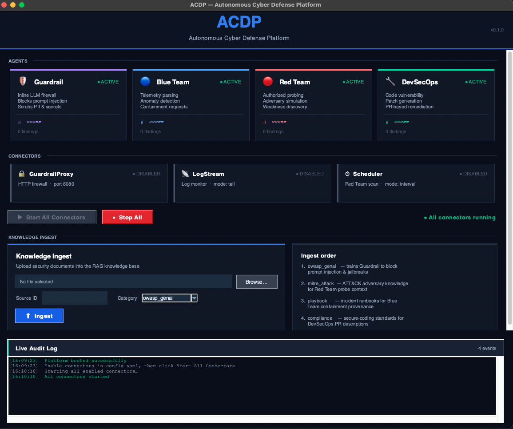

<div align="center">

# ACDP
### Autonomous Cyber Defense Platform

**A RAG-backed multi-agent security platform powered by local or cloud LLMs**

[](https://python.org)
[](LICENSE)
[](pyproject.toml)

</div>

---

## Overview

ACDP is a production-grade autonomous cyber defense system that combines **Retrieval-Augmented Generation (RAG)** with four specialized AI agents coordinated by a central LangGraph orchestrator. It continuously monitors telemetry, screens LLM prompts, simulates adversary attacks, and auto-remediates code vulnerabilities — all with fail-closed authorization and tamper-evident audit logging.

<div align="center">



*ACDP Dashboard — agents, connectors, knowledge ingest, and live audit log in one unified window*

</div>

---

## Key Features

| Feature | Description |
| --- | --- |
| 🛡 **Guardrail Agent** | Inline LLM firewall — blocks prompt injection, scrubs PII and API keys from responses |
| 🔵 **Blue Team Agent** | Parses JSON/syslog/CEF telemetry, detects anomalies, triggers containment |
| 🔴 **Red Team Agent** | Authorized adversary simulation grounded in OWASP GenAI + MITRE ATT&CK/ATLAS |
| 🔧 **DevSecOps Agent** | Analyzes code vulnerabilities, generates patches, opens review-required PRs |
| 🧠 **RAG Core** | Qdrant vector store with semantic retrieval — agents cite sources for every decision |
| 🔒 **Authorization** | Fail-closed scope enforcement — agents can only act on assets you explicitly authorize |
| 📋 **Audit Log** | Append-only JSONL — every decision is recorded before it takes effect |
| 🖥 **GUI Dashboard** | Dark-themed desktop window with live agent status, animated indicators, and knowledge ingest |
| 🔀 **Multi-Provider LLM** | Ollama (local), OpenAI (ChatGPT), or Anthropic (Claude) — switchable via config |

---

## Architecture

```
                                        ┌─────────────────────────────────────┐
                                        │         Central Orchestrator        │
                                        │    (LangGraph state machine)        │
                                        └───────────────────┬─────────────────┘
                                                            │
                                      ┌──────────┬──────────┼──────────────┐
                                      │          │          │              │      
                               ┌──────▼─────┐ ┌──▼──────┐ ┌─▼──────┐ ┌─────▼────┐
                               │  Guardrail │ │Blue Team│ │Red Team│ │ DevSecOps│
                               │   Agent    │ │  Agent  │ │ Agent  │ │  Agent   │
                               └──────┬─────┘ └──┬──────┘ └─┬──────┘ └─┬────────┘
                                      └──────────┴──────────┴──────────┘
                                                            │
                                              ┌─────────────▼────────────┐
                                              │    Enterprise RAG Core   │
                                              │ OWASP · MITRE · Playbooks│
                                              │ Compliance · Topology    │
                                              └──────────────────────────┘
                                                            │
                                            ┌───────────────┴──────────────┐
                                            │    Authorization Service     │
                                            │  (fail-closed, scope-gated)  │
                                            └───────────────┬──────────────┘
                                                            │
                                                ┌───────────▼──────────┐
                                                │   Append-only        │
                                                │   Audit Log (JSONL)  │
                                                └──────────────────────┘
```

---

## Quick Start

### 1. Prerequisites

| Service | Purpose | Install |
| --- | --- | --- |
| **Python 3.11+** | Runtime | [python.org](https://python.org) |
| **Ollama** | Local LLM server | [ollama.com](https://ollama.com) |
| **Qdrant** | Vector store | `docker run -p 6333:6333 qdrant/qdrant` |

```bash
# Pull required models
ollama pull llama3
ollama pull nomic-embed-text
```

### 2. Install

```bash
git clone https://github.com/skishu0413/Autonomous-Cyber-Defense-Platform.git
cd Autonomous-Cyber-Defense-Platform
pip install -e ".[dev]"
```

### 3. Configure

```bash
cp config.example.yaml config.yaml
```

Edit `config.yaml` for your environment. Key settings:

```yaml
# LLM Provider — ollama | openai | anthropic
llm_provider: ollama
reasoning_model: llama3
embedding_model: nomic-embed-text

# Detection threshold
severity_threshold: high
containment_requires_approval: true

# Guardrail fallback when blocklist is empty
guardrail_default_action: block
```

### 4. Launch

```bash
python -m acdp
```

The GUI dashboard opens immediately. Platform boot happens in the background — you'll see each component tick green as it initialises.

---

## LLM Providers

Switch providers by changing `llm_provider` in `config.yaml`. Credentials come from environment variables only — never from config files.

| Provider | Config value | Env var | Example models |
| --- | --- | --- | --- |
| **Ollama** (local) | `ollama` | none | `llama3`, `mistral` |
| **OpenAI** | `openai` | `OPENAI_API_KEY` | `gpt-4o`, `gpt-4-turbo` |
| **Anthropic** | `anthropic` | `ANTHROPIC_API_KEY` | `claude-3-5-sonnet-20241022` |

```bash
# Use OpenAI
export OPENAI_API_KEY=sk-...
# In config.yaml:
# llm_provider: openai
# reasoning_model: gpt-4o
# embedding_model: text-embedding-3-small
```

---

## Knowledge Ingestion

Agents ground every decision in your security knowledge base. Ingest documents before running connectors.

```bash
# OWASP GenAI — trains Guardrail to detect prompt injection
python -m acdp ingest --source-id owasp-genai-v1 --category owasp_genai --file owasp-genai.pdf

# MITRE ATT&CK — grounds Red Team probes
python -m acdp ingest --source-id mitre-attack-v14 --category mitre_attack --file enterprise-attack.xlsx

# Incident playbooks — grounds Blue Team containment
python -m acdp ingest --source-id playbook-001 --category playbook --file incident-response.md

# Secure coding standards — grounds DevSecOps PR descriptions
python -m acdp ingest --source-id secure-coding-v1 --category compliance --file secure-coding-guide.pdf
```

Or use the **Knowledge Ingest panel** in the dashboard — browse a file, select a category, and click Ingest.

**Supported categories:** `owasp_genai` · `mitre_attack` · `mitre_atlas` · `playbook` · `compliance` · `topology` · `other`

**Supported formats:** PDF · Excel (XLSX) · Markdown · Plain text · CSV

---

## Production Connectors

Enable connectors in `config.yaml` to connect agents to live infrastructure.

```yaml
connectors:
  # Guardrail HTTP proxy — sits between users and your LLM
  guardrail_proxy:
    enabled: true
    port: 8080
    upstream_url: "http://localhost:11434/api/generate"

  # Blue Team log monitor — tails your log files in real time
  log_stream:
    enabled: true
    mode: tail                  # tail | syslog_udp | poll_dir
    log_path: /var/log/syslog

  # Red Team scheduler — runs probe campaigns on a schedule
  scheduler:
    enabled: true
    mode: interval
    interval_seconds: 3600
    targets:
      - "api.example.com"

  # DevSecOps GitHub integration
  github_pr_client:
    enabled: true
    # Set GIT_TOKEN env var — never put credentials in this file
```

Click **▶ Start All Connectors** in the dashboard to start all enabled connectors at once.

---

## Event Routing

The Orchestrator routes security events to agents automatically:

| Event type | Routed to |
| --- | --- |
| `telemetry` | Blue Team + Guardrail |
| `probe_request` | Red Team + Guardrail |
| `vulnerability_finding` | DevSecOps + Guardrail |
| `prompt` | Guardrail |
| `unknown` | Guardrail |

Guardrail is always included as a safety layer regardless of event type.

---

## Running Tests

```bash
# All unit and property-based tests
pytest

# Verbose output
pytest -v

# Specific test file
pytest tests/test_guardrail_inbound.py -v

# Integration tests (requires live Ollama + Qdrant)
pytest -m integration
```

Property-based tests use [Hypothesis](https://hypothesis.readthedocs.io) — 305 tests covering 26 correctness properties.

---

## Project Structure

```
src/acdp/
├── main.py                  # Platform entry point — wires all components
├── models.py                # Shared Pydantic v2 data models
├── exceptions.py            # Platform exceptions
├── config/                  # YAML config loader
├── audit/                   # Append-only JSONL audit log
├── llm_gateway/             # OllamaGateway, OpenAIGateway, AnthropicGateway
├── knowledge_base/          # RAG core — ingest, embed, retrieve
├── authorization/           # Fail-closed scope enforcement
├── agents/
│   ├── guardrail_agent.py   # Prompt screening + PII scrubbing
│   ├── blue_team_agent.py   # Telemetry parsing + anomaly detection
│   ├── red_team_agent.py    # Authorized adversary simulation
│   └── devsecops_agent.py   # Vulnerability remediation via PRs
├── orchestrator/            # LangGraph dispatch state machine
└── cli/
    ├── dashboard.py         # GUI dashboard (tkinter)
    ├── ingest.py            # CLI ingest subcommand
    ├── monitor.py           # CLI monitor subcommand
    ├── serve.py             # CLI serve subcommand
    └── scan.py              # CLI scan subcommand

tests/                       # 305 unit + property-based tests
config.example.yaml          # Annotated example configuration
docs/                        # Screenshots and documentation assets
```

---

## Security Design Principles

- **Fail-closed** — every authorization ambiguity resolves to deny
- **Audit-before-act** — decisions are written to the audit log before they take effect
- **No credentials in config** — all API keys come from environment variables
- **Scope-expiring** — every agent action requires an explicit, time-limited `TargetScope`
- **Provider-agnostic** — swap LLM providers without touching agent code

---

<div align="center">

Made with purpose — autonomous defense for the modern threat landscape

</div>
